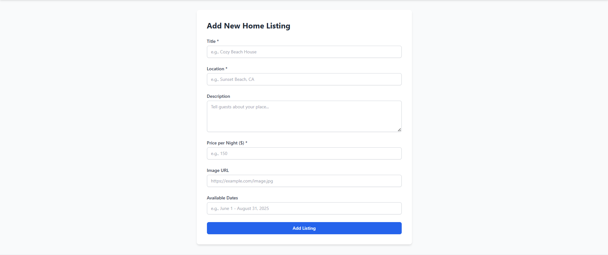

# HomeShare Frontend - React Assessment Project

A frontend application for a home sharing platform where users can browse listings, view details, and simulate booking homes. This project was built as part of a Node.js Experts Assessment, focusing primarily on frontend development using React, Vite, and Tailwind CSS, with mock data and functionality.

**Built on:** Sunday, May 4, 2025
**Location:** Nagpur, Maharashtra, India

---

## Live Demo

🔗 **Live Site:** [https://home-sharing-frontend.vercel.app/](https://home-sharing-frontend.vercel.app/)

---

## Screenshots

**Home Page:**


**Listings Page:**


**Listing Detail Page:**


---

## Features

* **Browse Listings:** View all available home listings fetched from static JSON data.
* **View Listing Details:** See detailed information for a specific listing, including description, price, availability, and owner (mock).
* **Responsive Design:** User interface adapts to different screen sizes (desktop, tablet, mobile) using Tailwind CSS.
* **Mock User Authentication:** Simulate user login and registration using React Context and static user data.
* **Protected Routes:** Certain routes (e.g., Add Listing, My Bookings) are only accessible to logged-in users.
* **Mock Add Listing:** Logged-in users can fill out a form to simulate adding a new listing (data logged to console).
* **Mock Booking Request:** Logged-in users can select dates and simulate requesting a booking on the listing detail page (data logged to console).

---

## Tech Stack

* **Framework/Library:** React.js v18+
* **Build Tool:** Vite
* **Language:** JavaScript (ES6+)
* **Styling:** Tailwind CSS v3
* **Routing:** React Router DOM v6
* **State Management:** React Context API (for Auth) + Component State (`useState`, `useEffect`)
* **Data:** Static JSON files (`/src/data/`)
* **Deployment:** Vercel (via GitHub Repository)

---

## Project Setup & Installation

To run this project locally, follow these steps:

1.  **Clone the repository:**
    ```bash
    git clone https://github.com/INCREDIBLE18/home-sharing-frontend.git
    ```

2.  **Navigate into the project directory:**
    ```bash
    cd home-sharing-frontend
    ```

3.  **Install dependencies:**
    ```bash
    npm install
    # or if you use yarn
    # yarn install
    ```

---

## Running Locally

Once dependencies are installed, start the development server:

```bash
npm run dev
# or
# yarn dev
